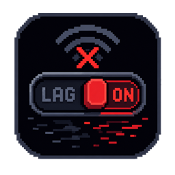

# LagSwitch

Un simulateur de conditions réseau pour Windows. Il coupe et rétablit la connexion à la
demande — toute la machine, ou une seule application — pour voir comment un jeu ou un client
se comporte quand le réseau lâche : déconnexion franche, micro-coupures, perte de paquets.

Un seul `.exe`, rien à installer, aucun pilote.

---

## Ce qu'il fait

| Mode | Ce qui se passe |
|---|---|
| **Bascule** | Une pression coupe, la suivante rétablit. |
| **Impulsion** | Une pression coupe pendant une durée fixe, puis la ligne revient toute seule. |
| **Maintien** | La connexion est coupée tant que la touche reste enfoncée. |
| **Instable** | Alterne coupures et retours en boucle. C'est le mode qui ressemble le plus à une vraie mauvaise connexion. |

La **cible** se choisit dans l'application : soit tout le trafic de la machine, soit le trafic
d'un seul exécutable. Le second est presque toujours le bon choix — on teste son jeu sans
couper le chat vocal, le navigateur et le reste. Roblox et Roblox Studio ont un bouton dédié.

Le **sens** se choisit aussi : les deux, montant seul, ou descendant seul. Le montant seul est
le plus révélateur sur une physique à autorité client — le serveur cesse de t'entendre pendant
que ton client continue de voir le monde avancer, et c'est exactement ce qui produit les
rubber-bands et les téléportations.

Le raccourci est global : il fonctionne quand le jeu est au premier plan. En contrepartie
Windows le lui retire, donc mieux vaut éviter une touche utilisée en jeu.

## L'honnêteté de l'affichage

Un instrument de test qui ment est pire qu'un instrument absent. Deux mécanismes s'en assurent.

**Il refuse de couper quand il ne peut pas.** Si le pare-feu Windows est éteint sur le profil
en cours, basculer les règles réussit parfaitement et ne bloque rien. Dans ce cas LagSwitch
affiche `[ INACTIF ]`, désactive le bouton et ignore le raccourci, au lieu d'annoncer une
coupure imaginaire.

**Il mesure au lieu de supposer.** Une sonde interroge un hôte toutes les 700 ms et affiche le
RTT réel. Si l'état annoncé est « coupé » alors que le trafic répond encore, elle le dit en
rouge. Elle est honnête sur ses propres limites : en cible par application, elle mesure le
trafic de LagSwitch et pas celui de la cible, et elle le signale ; si l'hôte n'a jamais
répondu, elle prévient que son silence ne prouve rien.

**La cible suit son processus.** C'est le nom du processus qui fait foi, pas le chemin : Roblox
vit dans un dossier `version-<hash>` qui change à chaque mise à jour, et une règle clouée sur
l'ancien chemin resterait en place sans plus rien bloquer. Le chemin est re-résolu à
l'armement et surveillé toutes les 3 secondes.

## Le retour en jeu

Une pastille toujours au-dessus affiche l'état sans quitter le plein écran — elle n'accepte ni
le focus ni les clics, donc elle ne vole jamais la souris au jeu. Un jeu en plein écran
*exclusif* la masquera quand même : c'est une limite de Windows. Deux bips synthétisés, une
chute pour la coupure et une montée pour le retour, doublent l'information à l'oreille.

## Les garde-fous

Une application qui coupe le réseau doit être incapable de le laisser coupé.

- **Plafond de durée.** Toute coupure se termine d'elle-même au bout du délai réglé (15 s par défaut).
- **Bouton Panique.** Rétablit immédiatement, quel que soit le mode.
- **Sortie propre.** Les règles sont retirées à la fermeture, et le `finally` du moteur remet
  la ligne même en cas d'exception.
- **Balayage au démarrage.** Si l'application a été tuée en pleine coupure, l'instance suivante
  supprime les règles orphelines dès son lancement.
- **Instance unique.** Deux LagSwitch partageraient le même jeu de règles ; le second refuse de démarrer.

## Ce qu'il faut savoir avant

**Il faut les droits administrateur.** Écrire dans la base de règles du pare-feu Windows en
exige ; le manifeste demande donc l'élévation au lancement.

**Le pare-feu Windows doit être actif.** LagSwitch bloque en posant des règles de blocage :
si le pare-feu est éteint sur le profil en cours, les règles existent mais ne s'appliquent
pas. L'application le détecte, l'affiche, et propose de l'activer — avec une case pour le
remettre comme avant en quittant. Activer le pare-feu remet aussi Windows à refuser les
connexions entrantes non sollicitées, ce qui peut gêner un serveur local, une VM ou un
partage réseau.

**Ce n'est pas un outil pour tricher.** Couper sa connexion dans un jeu en ligne compétitif
pour se rendre intouchable, c'est de la triche, et ça se solde par un bannissement. L'outil
est fait pour tester ses propres applications.

## Faire tourner le projet

Il faut le [SDK .NET 8](https://dotnet.microsoft.com/download/dotnet/8.0) et Windows.

```bash
dotnet run --project src/LagSwitch
```

Pour produire un exécutable autonome :

```bash
dotnet publish src/LagSwitch -c Release -r win-x64 --self-contained -p:PublishSingleFile=true
```

Un tag `v*` poussé sur le dépôt suffit à produire une release : le workflow
`.github/workflows/release.yml` compile les deux variantes (autonome et légère), les zippe et
les attache à la release GitHub.

```bash
git tag v1.0.0 && git push origin v1.0.0
```

## Sous le capot

**Deux règles, posées une fois.** L'application crée au démarrage une règle de blocage
entrante et une sortante, désactivées. Couper ne fait que basculer leur booléen `Enabled` :
quelques millisecondes, là où créer puis supprimer les règles à chaque coupure en prendrait
des centaines. Cibler une application revient à renseigner `ApplicationName` sur ces deux
règles.

**Un seul thread parle au pare-feu.** L'API COM du pare-feu n'aime pas être appelée depuis
plusieurs threads. `Core/FirewallEngine.cs` tient un thread STA dédié avec une file de
travaux ; toute l'application passe par lui, et le thread d'interface ne bloque jamais.

**Les quatre modes sont le même automate.** `Core/CutEngine.cs` joue un motif « couper
pendant *cut*, rendre la ligne pendant *gap*, recommencer », avec `cut = 0` pour *rester
coupé* et `gap = 0` pour *ne pas recommencer*. La bascule, l'impulsion, le maintien et
l'instable ne sont que quatre jeux de valeurs, ce qui laisse un seul chemin de code à garantir
— et un seul `finally` qui remet la ligne.

**Le relâchement de touche est deviné.** `RegisterHotKey` ne signale que l'appui. Pour le mode
maintien, un fil interroge `GetAsyncKeyState` toutes les 10 ms jusqu'au relâchement.

**Les réglages sont locaux.** `%AppData%\LagSwitch\settings.json`. Pas de compte, pas de serveur.

**L'interface est un terminal.** Tout est en chasse fixe, les cases à cocher sont dessinées en
ASCII (`[ ]` / `[x]`), la barre de titre est redessinée via `WindowChrome`, et un très léger
grain de balayage passe par-dessus. La palette sort du logo : noir, gris ardoise, rouge d'alerte
— plus un vert de terminal, seule couleur ajoutée, parce que « la ligne est là » doit se lire
sans lire.

**Les sources portent un BOM UTF-8.** Sans lui, un `.cs` non-ASCII compilé sur un runner GitHub
Actions — dont la page de code par défaut n'est pas celle d'une machine française — sort avec
du texte mangé dans la release, sans la moindre erreur de compilation.

## Structure

```
src/LagSwitch/
├── Core/
│   ├── FirewallEngine.cs   règles de blocage, sens, état du pare-feu, thread COM dédié
│   ├── CutEngine.cs        automate des motifs de coupure et garde-fous
│   ├── LinkProbe.cs        mesure de l'état réel du lien
│   ├── HotkeyService.cs    raccourci global, détection du relâchement
│   ├── TargetCatalog.cs    résolution des cibles par nom de processus
│   ├── Tone.cs             les deux bips, calculés au démarrage
│   ├── Settings.cs         réglages et persistance JSON
│   └── Native.cs           les quelques appels Win32
├── Assets/                logo pixel et icône multi-tailles
├── MainWindow             état, cible, sens, mode, raccourci, garde-fous, journal
├── OverlayWindow          pastille d'état, sans focus ni clics
├── AppPickerWindow        choix de l'application à couper
└── Styles.xaml            palette, cartes, boutons ASCII, grain d'écran
```
